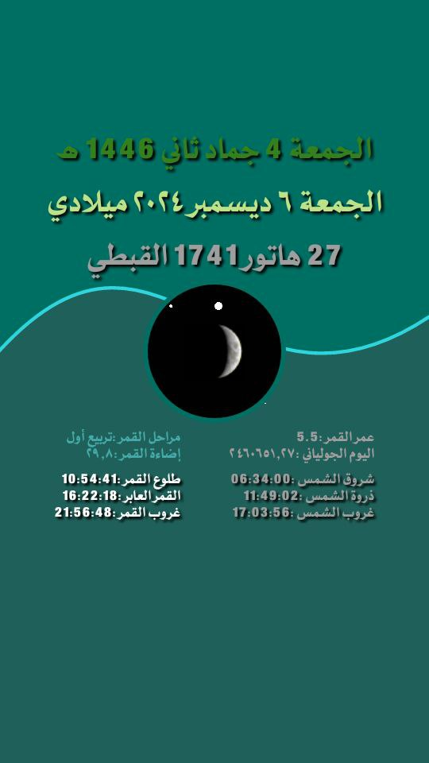

# PrayerTimes 
## Screenshots

<table style="width:100%">
  <tr>
    <td></th>
    <td></th>
    <td></th>
  </tr>
</table>
 

## :sparkles: Features:

- Prayer Times
- Qibla Direction
- Prayer Times Wallpapers
- Prayer Times Notifications
- App Widget

## 👨‍💻 About the developer
 I have planned, designed, and developed this application myself. I am Ahmed Fawzi Jalal, a lover of design, programming, an Android developer, and a programmer in Java, JavaScript, Python, and Lua. I have a great passion for developing smartphone applications. I have invested a lot of time and effort in developing this application to make it light, accurate, secure, and easy to use. This is by the grace of God, and, God willing, I will continue to improve, evolve, and fix any discovered errors in this application as long as I am capable of doing so. If you wish to support the development of this application Prefer to everyone's right
 ##

Made with :heart: 25/3/2024
